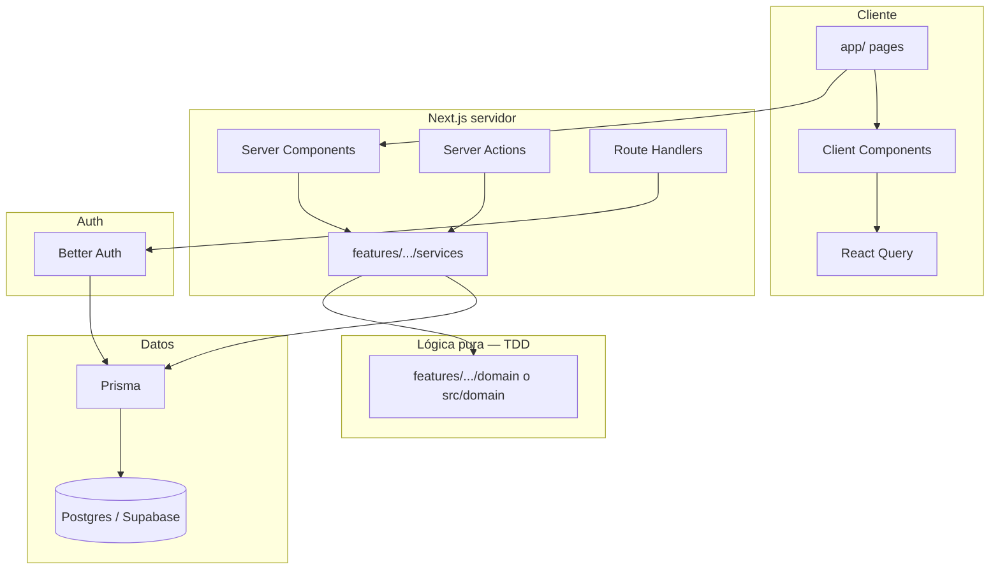

# Arquitectura — Finance Hub

Documento técnico obligatorio. Stack fijado en [stack.md](./stack.md) (plantilla Siturn). Producto y specs en el resto de `docs/`.

## Jerarquía de documentación

| Documento | Gana en |
|-----------|---------|
| **AGENTS.md** + **docs/specs/** | Alcance de producto / MVP / reglas de negocio |
| **docs/architecture.md** (este) + **docs/stack.md** | Decisiones técnicas, carpetas, auth, datos |
| **DESIGN.md** | UI / tokens / craft visual |
| **docs/tdd-workflow.md** | Cómo testear lógica de negocio |

---

## 1. Estilo

- **Monolito** Next.js App Router (frontend + backend, un deploy).
- **Sin** microservicios, colas dedicadas ni capas genéricas prematuras.
- Escala por **`src/features/<dominio>/`**, no fragmentando el runtime.
- Lógica de negocio **pura y testeable** (TDD) separada de UI y de Prisma.

## 2. Principios no negociables

1. **Server Components por defecto**; Client solo con interactividad, forms o hooks de cliente.
2. **Better Auth** para login; **no** Supabase Auth para usuarios del producto.
3. **Prisma** en servidor para datos relacionales; schema en `prisma/schema.prisma`.
4. **Supabase** = Postgres (+ Storage/Realtime/RLS cuando aplique); no reemplaza Prisma ni Better Auth.
5. **Server Actions:** `getSession()` + Zod **dentro** de cada action; authz por `workspaceId` + membership.
6. **Validación doble:** Zod en cliente (RHF) y servidor.
7. **Env** solo en `src/lib/env.ts`.
8. **TypeScript strict** — sin `any`.
9. **Zustand** solo estado de UI.
10. **TDD** en lógica de negocio; **no** tests de UI ([tdd-workflow.md](./tdd-workflow.md), ADR-003).
11. **Dinero** en centavos enteros (ADR-001); tenancy por **Workspace** (ADR-002).
12. **Git Flow:** no commitear en `develop` ni `main`; ramas `feat/`, `fix/`, `chore/`.

## 3. Diagrama de capas



## 4. Stack (resumen)

Detalle y versiones → [stack.md](./stack.md).

| Pieza | Uso |
|-------|-----|
| Next.js 16 App Router | RSC, Client, Server Actions, Route Handlers |
| Better Auth | Sesiones de producto (`/api/auth/[...all]`) |
| Prisma + pg | ORM; client en `src/generated/prisma` vía `@/lib/prisma` |
| Postgres (Supabase) | DB; `DATABASE_URL` / `DIRECT_URL` |
| Zod + RHF | Forms y validación de actions |
| TanStack Query | Datos en cliente |
| Zustand | UI efímera |
| Vitest | Tests de `domain` / servicios puros |
| shadcn + Tailwind 4 | UI; tokens en `DESIGN.md` / `globals.css` |

## 5. Estructura de carpetas

```txt
.
├── prisma/
│   ├── schema.prisma
│   └── migrations/
├── docs/                      # Specs SDD, dominio, TDD
└── src/
    ├── app/                   # Rutas (páginas delgadas)
    │   ├── api/auth/[...all]/
    │   ├── (auth)/login
    │   ├── (auth)/registro
    │   └── dashboard/
    ├── components/            # UI compartida + providers + ui/ (shadcn)
    ├── domain/                # Value objects y reglas compartidas (Money, …) — TDD
    ├── features/
    │   ├── auth/
    │   ├── workspaces/
    │   ├── accounts/
    │   ├── categories/
    │   ├── transactions/
    │   ├── budgets/
    │   ├── goals/
    │   ├── splits/
    │   └── dashboard/
    │       ├── components/
    │       ├── actions/       # Server Actions
    │       ├── services/      # Orquestación + Prisma
    │       ├── domain/        # Reglas puras del feature — TDD
    │       ├── schemas/       # Zod
    │       └── types/
    ├── hooks/
    ├── lib/                   # env, auth, prisma, session, supabase, utils
    ├── services/              # Transversal entre features
    ├── schemas/
    ├── types/
    └── utils/
```

### Reglas de ubicación

| Qué | Dónde | No poner en |
|-----|-------|-------------|
| Página/ruta | `app/` | `features/` (salvo composición) |
| UI de dominio | `features/<d>/components/` | Lógica de saldo/split |
| Reglas puras (TDD) | `features/<d>/domain/` o `src/domain/` | Components, actions |
| Orquestación + Prisma | `features/<d>/services/` | Client Components |
| Server Action | `features/<d>/actions/` | Sin `getSession` + Zod |
| Schema Zod | `features/<d>/schemas/` | Inline sin reutilizar |
| Infra auth/db | `src/lib/` | Features |

### Páginas delgadas

```tsx
// ✅ page orquesta
export default async function AccountsPage() {
  const session = await getSession()
  if (!session) redirect('/login')
  return <AccountsView workspaceId={...} />
}
```

## 6. Auth

- Servidor: `src/lib/auth.ts`, `src/lib/session.ts` → `getSession()`
- Cliente: `src/lib/auth-client.ts` → `signIn`, `signUp`, `signOut`, `useSession`
- Handler: `src/app/api/auth/[...all]/route.ts`
- Tras registro: crear Workspace `personal` + Membership `owner` (SPEC-01) en servicio de aplicación, no en el Client Component
- Middleware: cookie prefijo `better-auth*`; proteger `/dashboard`; rutas `/login`, `/registro`

## 7. Datos

- Schema Prisma = fuente de verdad relacional
- Runtime: `DATABASE_URL`; migraciones CLI: `DIRECT_URL`
- Multi-tenant: todo modelo de negocio con `workspaceId`; verificar membership en cada action/service
- RLS en Postgres como defensa en profundidad (alineado a workspace), sin sustituir checks en servidor
- Logs SQL de Prisma: por defecto **no** se imprimen `query` en desarrollo. Activar solo con `PRISMA_LOG_QUERIES=1` (o `true`) vía `src/lib/env.ts` — ver [stack.md](./stack.md)

### 7.1 Memoización por request (`React.cache`)

El layout `(app)` y las páginas suelen resolver **sesión, usuario, workspace activo y membership** en el mismo render RSC. Sin deduplicación, cada llamada reabre Prisma.

**Patrón adoptado:** envolver lecturas de tenancy / auth frecuentes con `cache()` de React (`src/lib/session.ts`, `getCurrentUser`, `getActiveWorkspaceForUser`, `requireMembership`, `listMyWorkspaces`). El cache **muere al terminar el request**; no hay TTL ni almacenamiento entre navegaciones.

**Presupuestos:** `listBudgetsWithStatus` separa un snapshot DB request-scoped (`budgets` + expenses del workspace) del cálculo de `progress` con `referenceDate`. Así layout (badge de nav), `/budgets`, `GetDashboard` y analytics pueden compartir **una** carga SQL sin servir progreso stale por fecha distinta.

**Args:** `React.cache` usa igualdad superficial (`Object.is`). Preferir parámetros **primitivos** (`userId`, `workspaceId`, `includeArchived`) en las funciones cacheadas; no pasar objetos inline como única clave.

**Prohibido (riesgo de datos inconsistentes):**

| No cachear así | Motivo |
|----------------|--------|
| Saldos / ledger / listados de txs entre requests (`unstable_cache`, LRU TTL) | Mutaciones frecuentes; UI de dinero incorrecta |
| Membership / roles con TTL cross-request | Authz stale tras expulsión o cambio de rol |
| Dashboard / analytics “congelados” sin tags de invalidación por mutación | Hoy solo hay `revalidatePath`; no hay tag matrix |

Tras mutaciones se sigue invalidando con `revalidatePath` (página + layout cuando el shell debe refrescar). Eso **re-ejecuta** el request; el `React.cache` no evita trabajo entre navegaciones.

## 8. Flujo de una mutación

```txt
UI (RHF + Zod)
  → Server Action (getSession + Zod + authz workspace)
    → feature service (Prisma)
      → domain puro (invariantes / cálculos)  ← TDD aquí
```

## 9. Testing

| Capa | Estrategia |
|------|------------|
| `src/domain/**` y `features/*/domain/**` | Unit TDD (Vitest) |
| Servicios con reglas | Unit con fakes / sin UI |
| Prisma / Better Auth | Integración opcional más adelante |
| UI (React, CSS) | **No se testea** |

## 10. Features ↔ specs

| Feature folder | Spec |
|----------------|------|
| `auth` | [01-auth](./specs/01-auth.md) |
| `workspaces` | [02-workspaces](./specs/02-workspaces.md) |
| `accounts` | [03-accounts](./specs/03-accounts.md) |
| `categories` | [04-categories](./specs/04-categories.md) |
| `transactions` | [05](./specs/05-transactions.md) + [06](./specs/06-transfers.md) |
| `budgets` | [07-budgets](./specs/07-budgets.md) |
| `goals` | [08-goals](./specs/08-goals.md) |
| `splits` + overview grupo | [09](./specs/09-financial-groups.md) + [10](./specs/10-expense-splitting.md) |
| analytics | [11-analytics](./specs/11-analytics.md) |
| `dashboard` | [12-dashboard](./specs/12-dashboard.md) |

## 11. Qué no hacer

- Lógica de negocio en Client Components
- `process.env` fuera de `src/lib/env.ts`
- Supabase Auth para login
- Tests de UI por defecto
- Floats para dinero
- Queries Prisma en páginas gordas sin pasar por services
- Cache cross-request de saldos, membership o dashboards “por TTL” sin invalidación explícita (ver §7.1)
- Confiar en `prisma:query` en consola como métrica de producción: el log es opt-in en desarrollo
