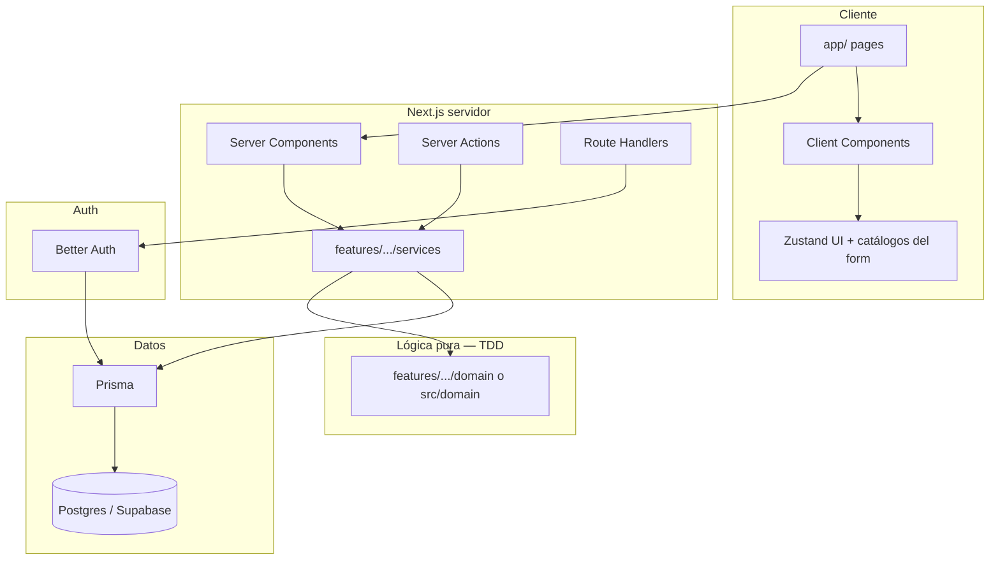

# Arquitectura — Finance Hub

Documento técnico obligatorio. Stack fijado en [stack.md](./stack.md) (plantilla Siturn). Producto y specs en el resto de `docs/`.

## Jerarquía de documentación

| Documento | Gana en |
|-----------|---------|
| **AGENTS.md** + **docs/specs/** | Alcance de producto / MVP / reglas de negocio |
| **docs/architecture.md** (este) + **docs/stack.md** | Decisiones técnicas, carpetas, auth, datos, shell autenticado |
| **DESIGN.md** | UI / tokens / craft visual |
| **docs/tdd-workflow.md** | Cómo testear lógica de negocio |

---

## 1. Estilo

- **Monolito** Next.js App Router (frontend + backend, un deploy).
- **Sin** microservicios, colas dedicadas ni capas genéricas prematuras.
- Escala por **`src/features/<dominio>/`**, no fragmentando el runtime.
- Lógica de negocio **pura y testeable** (TDD) separada de UI y de Prisma.

## 2. Principios no negociables

1. **Server Components por defecto**; Client solo con interactividad, forms o hooks de cliente.
2. **Better Auth** para login; **no** Supabase Auth para usuarios del producto.
3. **Prisma** en servidor para datos relacionales; schema en `prisma/schema.prisma`.
4. **Supabase** = Postgres (+ Storage/Realtime/RLS cuando aplique); no reemplaza Prisma ni Better Auth.
5. **Server Actions:** `getSession()` + Zod **dentro** de cada action; authz de **ledger** por `workspaceId` + membership del personal. Authz de `SplitGroup` por `SplitGroupMember` (ADR-007) — no exigir membership en el tenant del creador.
6. **Validación doble:** Zod en cliente (RHF) y servidor.
7. **Env** solo en `src/lib/env.ts`.
8. **TypeScript strict** — sin `any`.
9. **Zustand** solo estado de UI.
10. **TDD** en lógica de negocio; **no** tests de UI ([tdd-workflow.md](./tdd-workflow.md), ADR-003).
11. **Dinero** en centavos enteros (ADR-001); tenancy de ledger por **Workspace personal** (ADR-002 enmendado por ADR-007). Círculos de splits = `SplitGroup`, no un segundo tenant.
12. **Git Flow:** no commitear en `develop` ni `main` (excepto bot de CI para changelog/release); ramas `feat/`, `fix/`, `chore/`; borrar ramas al mergear. Detalle: [guides/git-flow.md](./guides/git-flow.md).
13. **Changelog / SemVer:** Keep a Changelog + Conventional Commits + git-cliff; Unreleased en `develop`, release en `main`. Detalle: [guides/changelog.md](./guides/changelog.md), ADR-005.

## 3. Diagrama de capas


```mermaid
flowchart TB
  subgraph client [Cliente]
    Pages[app/ pages]
    CC[Client Components]
    Z[Zustand UI + catálogos del form]
  end
  subgraph server [Next.js servidor]
    RSC[Server Components]
    SA[Server Actions]
    RH[Route Handlers]
    SVC[features/.../services]
  end
  subgraph pure [Lógica pura — TDD]
    DOM[features/.../domain o src/domain]
  end
  subgraph data [Datos]
    Prisma[Prisma]
    PG[(Postgres / Supabase)]
  end
  subgraph auth_layer [Auth]
    BA[Better Auth]
  end
  Pages --> RSC
  Pages --> CC
  CC --> Z
  RSC --> SVC
  SA --> SVC
  SVC --> DOM
  SVC --> Prisma
  RH --> BA
  Prisma --> PG
  BA --> Prisma
```

## 4. Stack (resumen)

Detalle y versiones → [stack.md](./stack.md).

| Pieza | Uso |
|-------|-----|
| Next.js 16 App Router | RSC, Client, Server Actions, Route Handlers |
| Better Auth | Sesiones de producto (`/api/auth/[...all]`) |
| Prisma + pg | ORM; client en `src/generated/prisma` vía `@/lib/prisma` |
| Postgres (Supabase) | DB; `DATABASE_URL` / `DIRECT_URL` |
| Zod + RHF | Forms y validación de actions |
| Zustand | UI efímera (sheets, splash post-mutación) |
| Vitest | Tests de `domain` / servicios puros |
| shadcn + Tailwind 4 | UI; tokens en `DESIGN.md` / `globals.css` |
| Resend | Email transaccional (reset) y marketing (contacts/broadcasts) |

## 5. Estructura de carpetas

```txt
.
├── prisma/
│   ├── schema.prisma
│   └── migrations/
├── docs/                      # Specs SDD, dominio, TDD
└── src/
    ├── app/                   # Rutas (páginas delgadas)
    │   ├── api/auth/[...all]/
    │   ├── (auth)/login
    │   ├── (auth)/registro
    │   └── dashboard/
    ├── components/            # UI compartida + providers + ui/ (shadcn)
    ├── domain/                # Value objects y reglas compartidas (Money, …) — TDD
    ├── features/
    │   ├── auth/
    │   ├── workspaces/
    │   ├── accounts/
    │   ├── categories/
    │   ├── transactions/
    │   ├── budgets/
    │   ├── goals/
    │   ├── splits/
    │   ├── dashboard/
    │   └── email/             # Resend: reset + marketing (SPEC-21)
    │       ├── components/    # (layout típico de feature)
    │       ├── actions/
    │       ├── services/
    │       ├── domain/
    │       └── schemas/
    ├── hooks/
    ├── lib/                   # env, auth, prisma, session, supabase, resend, utils
    ├── services/              # Transversal entre features
    ├── schemas/
    ├── types/
    └── utils/
```

### Reglas de ubicación

| Qué | Dónde | No poner en |
|-----|-------|-------------|
| Página/ruta | `app/` | `features/` (salvo composición) |
| UI de dominio | `features/<d>/components/` | Lógica de saldo/split |
| Reglas puras (TDD) | `features/<d>/domain/` o `src/domain/` | Components, actions |
| Orquestación + Prisma | `features/<d>/services/` | Client Components |
| Server Action | `features/<d>/actions/` | Sin `getSession` + Zod |
| Schema Zod | `features/<d>/schemas/` | Inline sin reutilizar |
| Infra auth/db | `src/lib/` | Features |

### Páginas delgadas

```tsx
// ✅ page orquesta
export default async function AccountsPage() {
  const session = await getSession()
  if (!session) redirect('/login')
  return <AccountsView workspaceId={...} />
}
```

## 6. Auth

- Servidor: `src/lib/auth.ts`, `src/lib/session.ts` → `getSession()`
- Cliente: `src/lib/auth-client.ts` → `signIn`, `signUp`, `signOut`, `useSession`
- Handler: `src/app/api/auth/[...all]/route.ts`
- Tras registro: crear Workspace `personal` + Membership `owner` (SPEC-01) en servicio de aplicación, no en el Client Component
- Post-registro / sesión en forms de auth: navegar a `/onboarding` (SPEC-15) si el espacio aún no está listo
- Middleware: cookie prefijo `better-auth*`; proteger rutas autenticadas; forms `/login`, `/registro` redirigen a `/onboarding` si hay sesión
- Cookies de producto: `fh-workspace-id` (activo), `fh-setup-dismissed` (omitió onboarding con 0 cuentas), `fh-invite-token` (invite pendiente), `fh-shell` (`compact` | `full`, breakpoint `md` vía matchMedia — no User-Agent; elige el árbol RSC del Panel, **no** cachea saldos)

### 6.1 Onboarding (fuera del shell)

- Ruta: `src/app/(onboarding)/onboarding` — layout soft full-viewport **sin** AppShell/sidebar
- Gate: `src/app/(app)/layout.tsx` redirige a `/onboarding` cuando `GetWorkspaceSetupStatus.needsSetup`
- Detalle de producto: [specs/15-workspace-onboarding.md](./specs/15-workspace-onboarding.md)

## 7. Datos

- Schema Prisma = fuente de verdad relacional
- Runtime: `DATABASE_URL`; migraciones CLI: `DIRECT_URL`. Preview/prod: `npm run db:deploy` corre **antes** de `next build` en Vercel.
- Multi-tenant: todo **ledger** con `workspaceId`; verificar membership del **propio** personal en cada action/service de dinero. **Excepción (ADR-007):** `SplitGroup` se autoriza por `SplitGroupMember` `kind=user` (o `publicShareToken` en lectura). El `ExpenseSplit` puede FK-referenciar una `Transaction` de **otro** workspace personal (IOU ≠ ledger compartido).
- RLS en Postgres como defensa en profundidad **deny-all** para `anon` / `authenticated` (KRI-18). No sustituye membership en servidor. Prisma (`DATABASE_URL`) bypasea RLS. Data API no debe exponer `public` (schema `postgrest_locked` o Data API off). Tras un `CREATE TABLE` nuevo en `public`, ejecutar `SELECT public.apply_rls_lockdown_to_public_tables();` (el rol `postgres` de Supabase no puede crear event triggers). Detalle: [security-audit.md](./security-audit.md) §1.
- Logs SQL de Prisma: por defecto **no** se imprimen `query` en desarrollo. Activar solo con `PRISMA_LOG_QUERIES=1` (o `true`) vía `src/lib/env.ts` — ver [stack.md](./stack.md)

### 7.1 Memoización por request (`React.cache`)

El layout `(app)` y las páginas suelen resolver **sesión, usuario, workspace activo y membership** en el mismo render RSC. Sin deduplicación, cada llamada reabre Prisma.

**Patrón adoptado:** envolver lecturas de tenancy / auth frecuentes con `cache()` de React (`src/lib/session.ts`, `getCurrentUser`, `getActiveWorkspaceForUser`, `requireMembership`, `listMyWorkspaces`). El cache **muere al terminar el request**; no hay TTL ni almacenamiento entre navegaciones.

**Presupuestos:** `listBudgetsWithStatus` carga un snapshot request-scoped (`budgets` + expenses) y calcula `progress` por call. Los expenses se filtran a la **unión de periodos activos** (`unionBudgetPeriodBounds`), no al ledger completo. El badge de nav usa `summarizeBudgetsAtRisk` / `summarizeBudgetNavSignal` sobre ese snapshot (`atRisk` + `exceeded` en una pasada). Layout badge, `/budgets` y `GetDashboard` comparten la misma carga SQL en el request.

Mutaciones de **ledger** (crear/editar/borrar movimiento) invalidan páginas de dinero (`revalidateMoneyPaths`: `/transactions`, `/accounts`, `/dashboard`, `/budgets`, y grupos/objetivos si aplica). **No** llaman `revalidatePath("/", "layout")`: eso vacía el Client Router Cache del shell. El badge de presupuestos en riesgo se actualiza en el próximo render de layout. Mutaciones que sí cambian el chrome (workspace, cuentas, categorías, setup) siguen revalidando el layout.

**Args:** `React.cache` usa igualdad superficial (`Object.is`). Preferir parámetros **primitivos** (`userId`, `workspaceId`, `includeArchived`) en las funciones cacheadas; no pasar objetos inline como única clave.

**Prohibido (riesgo de datos inconsistentes):**

| No cachear así | Motivo |
|----------------|--------|
| Saldos / ledger / listados de txs entre requests (`unstable_cache`, LRU TTL, `"use cache"` sin tag) | Mutaciones frecuentes; UI de dinero incorrecta |
| Membership / roles con TTL cross-request | Authz stale tras expulsión o cambio de rol |
| Dashboard / analytics “congelados” sin tags de invalidación por mutación | Hoy `revalidatePath` por ruta; Cache Components + `cacheTag` es el siguiente paso (SPEC-20 §10) |

Tras mutaciones se sigue invalidando con `revalidatePath` de las **páginas de dinero**, no del layout salvo que el shell cambie. Eso **re-ejecuta** el request; el `React.cache` no evita trabajo entre navegaciones.

### 7.2 Navegación inmediata y Client Router Cache

Las páginas autenticadas son **RSC** (Prisma en servidor). El feedback al navegar no depende de cachear listados de dinero: depende de `loading.tsx` + cerrar el sidebar al click.

| Pieza | Rol |
|-------|-----|
| `loading.tsx` bajo `src/app/(app)/` (+ por ruta) | Suspense de segmento: skeleton inmediato; el shell sigue vivo |
| Cerrar sidebar móvil en click de `Link` | Feedback inmediato; no esperar el RSC destino |
| `experimental.staleTimes.dynamic: 0` | **Sin** Client Router Cache en segmentos dinámicos (default Next 15+) — evita aterrizar en un payload pre-mutación tras crear un gasto |
| `experimental.staleTimes.static: 180` | Reuso de loading boundaries / prefetch completo en segmentos estáticos |
| `src/lib/navigation.ts` | Helpers client post-mutación (`refreshAfterMutation`, `navigateAndRefresh`, `replaceAndRefresh`) |

**Layout del shell (`AppShell`):** `SkipLink` → `#main-content` (`SidebarInset`). `SidebarProvider` (contexto) envuelve **todo** el shell, incluido `MobileTabBar` / “Más”. El flex (`SidebarFrame`) envuelve **solo** sidebar + inset. `MobileTabBar` y `NewTransactionSheet` se montan **fuera** de ese flex (`position: fixed` abajo, `width: 100%`, sin `100vw`/`100dvw`). Si la tab bar es hermana flex de `SidebarInset`, aparece overflow horizontal y la barra sale del viewport visual. Cadena flex: `min-w-0 max-w-full` en frame/inset/`ContentPanel`; `html`/`body`: `overflow-x-hidden`. Craft y a11y: [DESIGN.md](../DESIGN.md) §3.1 / §3.4. El sheet “Más” usa `ThemeToggle variant="inline"` (segmented, sin dropdown anidado en el modal) y una sola identidad al pie.

**Contrato post-mutación (Client Components):**

1. Server Action llama `revalidatePath` de las páginas de dinero (`revalidateMoneyPaths`). `revalidatePath("/", "layout")` **solo** si el chrome del shell cambia (workspace, setup, categorías).
2. En el cliente: splash del monto + `onSuccess?.()` (cerrar sheet) en el mismo tick.
3. Luego `refreshAfterMutation(router)` si permanece en la misma ruta, o `navigateAndRefresh` / `replaceAndRefresh` si hay soft-nav.
4. Mientras llega el RSC, el patrimonio se **atenúa** (`MoneyFreshnessFrame`) — no se reemplaza con un saldo calculado en el cliente.

El `refresh` se difiere con `setTimeout(0)` para que corra **después** del `push`/`replace` y no pierda la carrera contra el Client Router Cache.

**Listados con paginación client-side:** no copiar `initialItems` de props a `useState` en el mount — derivar la primera página de props y usar state solo para páginas extra (`loadMore`).

### Prefetch (contrato)

- Destinos de `mainNavItems` / `mobileTabItems` / `mobileMoreNavItems` (`src/components/app-shell/nav-config.ts`) deben poder prefetcharse (idle tras pintar el shell; opcional intent en hover/focus/touchstart).
- Prefetch calienta el shell RSC; **no** relaja `staleTimes.dynamic: 0` ni habilita TTL cross-request de saldos (§7.1).
- Catálogos del sheet “Registrar” (cuentas, categorías, grupos de split — **nombres/ids, no saldos**): prefetch al montar el shell + cache de sesión en Zustand. Al abrir se revalida en background. No React Query.
- Coverage objetivo (SPEC-20): ≥90 % de taps del nav principal llegan a prefetch hit o in-flight.
- Al agregar un link de menú, incluirlo en la estrategia de prefetch.

### 7.3 PWA y Service Worker

Producto: [SPEC-20](./specs/20-performance-pwa.md). Manifest: `src/app/manifest.ts`.

| Permitido | Prohibido |
|-----------|-----------|
| Cache-first `/_next/static/*` (hashed / immutable) | Cache HTML dashboard / listados `(app)` |
| Manifest + install + shortcuts a cargar | Cache `/api/*` o sesiones |
| Offline form de carga + `/offline` | Mostrar saldos / patrimonio stale offline |
| Install prompt existente | Workbox “offline app” genérico / offline ledger |

**Filosofía:** saldos viejos sin avisar son **peores** que offline. El SW (si existe) es **custom** y de alcance deliberadamente chico — no un precache de la app entera.

Headers / CDN (Vercel): estáticos `/_next/static` con cache largo **solo en producción** (`immutable`; filenames hasheados). En `next dev` se envía `Cache-Control: no-store` y, en HTML, `Clear-Site-Data: "cache"` para evictar entradas `immutable` viejas (Turbopack reusa URLs de chunk). HTML de `(app)` dinámico (`private, no-store`) — no “arreglar” TTFB cacheando paneles.

## 8. Flujo de una mutación

```txt
UI (RHF + Zod)
  → Server Action (getSession + Zod + authz workspace)
    → feature service (Prisma)
      → domain puro (invariantes / cálculos)  ← TDD aquí
```

## 9. Testing

| Capa | Estrategia |
|------|------------|
| `src/domain/**` y `features/*/domain/**` | Unit TDD (Vitest) |
| Servicios con reglas | Unit con fakes / sin UI |
| Prisma / Better Auth | Integración opcional más adelante |
| UI (React, CSS) | **No se testea** |

## 10. Features ↔ specs

| Feature folder | Spec |
|----------------|------|
| `auth` | [01-auth](./specs/01-auth.md) |
| `workspaces` | [02-workspaces](./specs/02-workspaces.md) |
| `accounts` | [03-accounts](./specs/03-accounts.md) |
| `categories` | [04-categories](./specs/04-categories.md) |
| `transactions` | [05](./specs/05-transactions.md) + [06](./specs/06-transfers.md) |
| `budgets` | [07-budgets](./specs/07-budgets.md) |
| `goals` | [08-goals](./specs/08-goals.md) |
| `splits` + overview grupo | [09](./specs/09-financial-groups.md) + [10](./specs/10-expense-splitting.md) |
| analytics | [11-analytics](./specs/11-analytics.md) |
| `dashboard` | [12-dashboard](./specs/12-dashboard.md) |
| `email` | [21-email-resend](./specs/21-email-resend.md) |
| shell / PWA / nav | [20-performance-pwa](./specs/20-performance-pwa.md) |

## 11. Qué no hacer

- Lógica de negocio en Client Components
- `process.env` fuera de `src/lib/env.ts`
- Supabase Auth para login
- Tests de UI por defecto
- Floats para dinero
- Queries Prisma en páginas gordas sin pasar por services
- Cache cross-request de saldos, membership o dashboards “por TTL” sin invalidación explícita (ver §7.1)
- Service Worker que cachee HTML de `(app)`, flights de dinero o `/api/*` (ver §7.3)
- Relajar `staleTimes.dynamic` para listados de dinero “por velocidad”
- Confiar en `prisma:query` en consola como métrica de producción: el log es opt-in en desarrollo
- Sustituir Better Auth / Vercel por PocketBase / Caddy u otro stack “porque Plata lo usa”
